### 1. 프로젝트 개요 (Overview)
이 프로젝트는 전 세계 뉴스 데이터(GDELT)를 실시간으로 처리하여, 다차원적인 글로벌 이벤트 분석이 가능한 End-to-End 데이터 플랫폼을 구축하는 것을 목표로 합니다.

GDELT 데이터는 하나의 사건이 **Events(핵심 사실), Mentions(출처), GKG(문맥)** 라는 세 종류의 데이터로 파편화되어 제공됩니다. 이 프로젝트의 핵심 과제는 15분마다 수집되는 이 반정형(Semi-structured) 데이터를 안정적으로 조합하여, 아래와 같은 데이터 분석가가 신뢰할 수 있는 '하나의 완성된 문장'으로 만들어내는 것이었습니다.

 **"A 국가가 B 국가와 회담했다(Fact)는 사건은, 특정 언론사(Source)에 의해 '긍정적'인 논조로 보도되었으며, '평화 협상'이라는 테마(Context)와 함께 언급되었다"**

이를 위해, 데이터 간의 시간차를 고려하고 파편화된 3종류의 데이터를 안정적으로 결합하여 신뢰도 높은 정형 데이터로 변환하는 파이프라인을 설계했습니다. 프로젝트의 최종 결과물은 데이터의 무결성을 실시간으로 검증하는 모니터링 대시보드와, 완성된 데이터를 기반으로 글로벌 이벤트를 심층 분석하는 시각화 대시보드를 구축하고, 예측 불가능한 장애에도 안정적으로 동작하는 데이터 플랫폼을 만드는 것을 최종 목표로 삼았습니다.

최종 대시보드의 화면입니다.
<table>
  <tr>
    <td>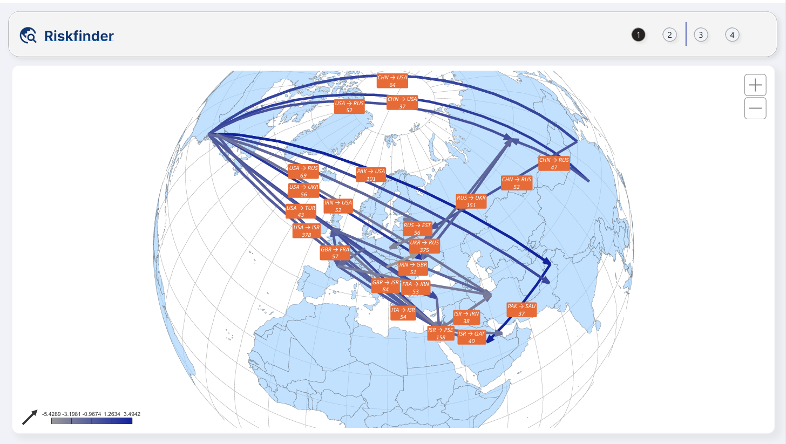</td>
    <td>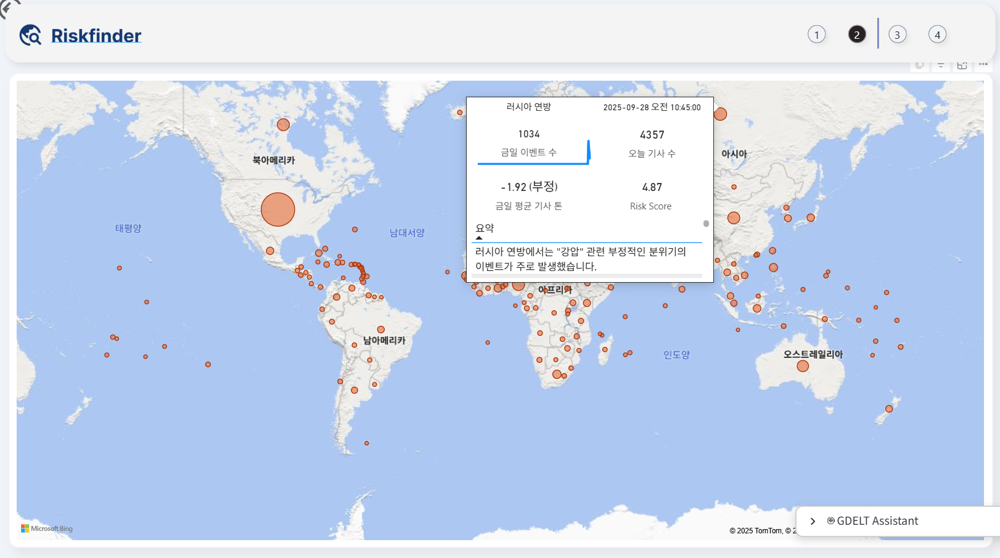</td>
  </tr>
  <tr>
    <td>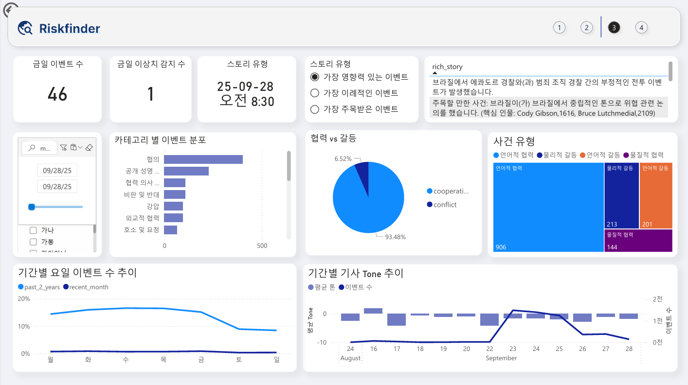</td>
    <td>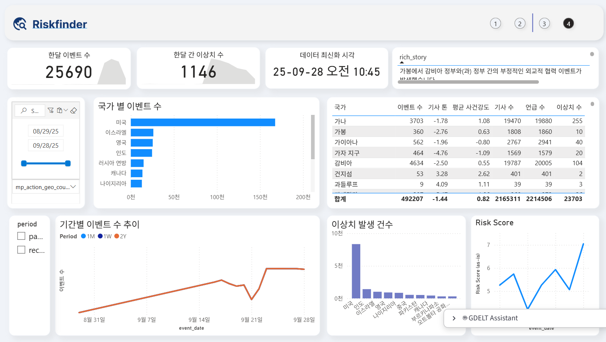</td>
  </tr>
</table>

#### 1.1 역할 및 기여 (Role & Contribution)
저는 본 4인 팀 프로젝트에서 Lead Data Engineer 역할을 맡아, 8-Node 분산 클러스터 인프라 구축부터 전체 데이터 아키텍처 설계, 그리고 핵심 파이프라인(Silver Layer) 개발까지 주도했습니다. GitHub 기준 전체 커밋의 약 90% (512/568)를 직접 작성 하며 대부분의 기술적 문제를 해결하고 프로젝트의 안정화를 이끌었습니다.

### 2. 시작하게 된 이유 (Motivation)

Azure 관리형 서비스 기반 프로젝트 경험을 통해 데이터 파이프라인의 `what`을 만드는 전체 흐름을 직접 설계하며 경험했습니다. 하지만 저는 그 편리한 블랙박스 뒤에서 일어나는 `how`와 `why`를 알고 싶었기 때문에, 클라우드 벤더에 종속되지 않는 기술력을 확보하기 위해, 오픈소스 스택을 기반으로 데이터 플랫폼을 처음부터 직접 구축하게 되었습니다.

<b>더 자세한 배경 및 의사결정 과정 보기(Click to expand)</b>

 
Microsoft의 데이터 엔지니어링 과정을 통해 Azure 관리형 서비스를 활용한 End-to-End 데이터 파이프라인을 두 차례 성공적으로 구축했습니다. 하지만 이 과정에서 채용 시장을 분석하며, 최고의 기술 기업들은 클라우드 활용 능력을 넘어, 오픈소스 기반 분산 시스템을 직접 구축하고 운영하는 역량이 핵심임을 파악했습니다. 이에 시장의 요구사항에 부합하는 데이터 엔지니어로서 성장하기 위해, 이 프로젝트의 기술 스택을 오픈소스로 직접 구성하기로 결정했습니다.

목표가 명확했기에, 공식적인 프로젝트 시작 한 달 전부터 학습에 돌입했습니다. `Docker`, `Kafka`, `Spark`, `Airflow` 등 데이터 엔지니어링의 핵심 오픈소스들을 처음부터 학습하며 `Docker-compose` 기반의 프로토타입 파이프라인을 구축했습니다. 이 경험을 바탕으로, 저는 단순히 팀에 합류하는 것을 넘어 프로젝트의 초기 비전을 직접 설계하고 팀을 구성하는 등 프로젝트를 주도했습니다. 데이터 엔지니어, 데이터 분석가, dbt 전문가 등 각 팀원의 역할을 명확히 정의했으며, 초반 아이디어를 제안했고, 팀원들과의 활발한 논의를 통해 GDELT 데이터 파이프라인이라는 복잡한 프로젝트를 함께 발전시켰습니다.

프로젝트 초기에는 3TB에 달하는 대규모 데이터 백필과 깊이 있는 성능 튜닝까지 목표로 삼았습니다. 하지만 제한된 시간과 기술적 실현 가능성을 고려하여, 저는 '화려한 성능 튜닝'이라는 부가 가치보다 데이터 파이프라인의 본질적 가치인 '데이터 신뢰성' 확보에 집중하는 것으로 목표를 재설정했습니다. 그 결과, 파이프라인의 상태(Health), 데이터 흐름, 핵심 지표인 조인 성공률 등을 실시간으로 모니터링 할 수 있는 대시보드를 구축했습니다. 이를 통해 단순히 '동작'하는 파이프라인을 넘어, 결과를 '신뢰'할 수 있는 데이터 플랫폼의 기반을 마련했습니다.

### 3. 아키텍처 (Architecture)
이 프로젝트의 아키텍처는 두 가지 핵심 원칙을 바탕으로 설계되었습니다.
- 특정 벤더에 종속되지 않는 기술적 독립성
- 실제 프로덕션 환경에 준하는 확장성과 안정성
#### 3.1 아키텍처 다이어그램

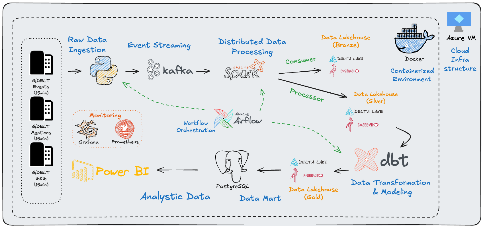
제가 설계한 파이프라인은 데이터 수집(Ingestion) -> 처리(Processing) -> 모델링(Modeling) -> 서빙(Serving)의 4단계를 거치는 End-to-End 아키텍처입니다. 각 단계는 메달리온 아키텍처를 따라 Bronze, Silver, Gold Layer로 나뉩니다.

**1. 데이터 수집 및 스트리밍 (Ingestion & Streaming)**
15분 주기로 GDELT 원본 데이터를 수집하는 Python Producer가 데이터를 Apache Kafka 토픽으로 전송합니다. 저는 예측 불가능한 트래픽 급증에도 데이터 유실이 없는 안정적인 파이프라인을 구축하기 위해, Kafka를 중앙 버퍼로 사용하여 데이터 생산자와 소비자를 분리하는 설계적 결정을 내렸습니다.

> **_Why Kafka?_**
> 후속 처리(Spark)의 장애나 예상치 못한 지연이 데이터 수집(Producer)에 영향을 주지 않도록, Kafka를 중앙 버퍼로 사용하여 두 시스템을 완벽히 분리했습니다. 이를 통해 전체 파이프라인의 안정성과 회복탄력성을 높였습니다.

**2. 데이터 처리 및 정제 (Processing & Cleansing - Bronze/Silver)**
Apache Spark 스트리밍 잡이 Kafka로부터 데이터를 실시간으로 소비(Consume)하여 Medallion 아키텍처에 따라 데이터를 처리합니다.
- **Bronze Layer**: 원본 데이터를 그대로 MinIO 데이터 레이크에 Delta Lake 포맷으로 적재하여 데이터의 원본성을 보존합니다.
- **Silver Layer**: Bronze 데이터를 정제하고, 3-way-join 등 핵심 비즈니스 규칙을 적용하여 신뢰할 수 있는 중간 데이터 셋을 구축합니다.

> **_Why Delta Lake on MinIO?_**
> 기존 데이터 레이크의 가장 큰 문제점인 신뢰성 없는 데이터와 데이터 일관성 문제를 해결하기 위해, S3 호환 오브젝트 스토리지 위에 ACID 트랜잭션과 스키마 진화를 지원하는 Delta Lake를 채택했습니다. 이를 통해 비용 효율적인 데이터 레이크 환경의 장점은 유지하되, 데이터 웨어하우스 수준의 데이터 신뢰성을 확보할 수 있었습니다.

**3. 데이터 변환 및 모델링 (Transformation & Modeling - Gold)**
Silver Layer의 데이터가 준비되면, **dbt**가 복잡한 비즈니스 로직과 집계를 적용하여 최종 분석에 사용될 **Gold 테이블**을 생성합니다.

> **_Why dbt?_**
> 저희는 Transform 과정을 데이터 웨어하우스 내부에서 수행하는 현대적인 ELT(Extract, Load, Transform) 패러다임을 채택했습니다. dbt는 바로 이 ELT의 T를 가장 강력하고 체계적으로 수행할 수 있는 도구입니다. SQL을 기반으로 모든 변화 로직을 코드로 관리하고, 데이터 리니지 추적, 테스트, 문서화를 자동화함으로써 데이터 모델의 신뢰성과 협업 효율성을 극대화했습니다.	

**4. 데이터 서빙 및 시각화 (Serving & Visualization)**
최종 완성된 Gold 데이터를 **PostgreSQL 데이터 마트**로 Migration하여 분석가와 BI 대시보드의 빠른 쿼리 성능을 보장합니다. **Power BI**와 **Grafana**가 이 데이터를 활용하여 비즈니스 인사이트 및 시스템 모니터링 대시보드를 제공합니다.

> **_Why a separate Data Mart?_**
> 분석용 쿼리의 부하가 ELT의 T(Transform) 과정에 영향을 주는 것을 원천적으로 차단하고, 최종 사용자에게 최적화된 스키마와 빠른 쿼리 성능을 제공하기 위해 데이터 처리와 데이터 서빙 계층을 물리적으로 분리했습니다.      

#### 3.2  인프라 및 오케스트레이션 (Automation & Orchestration)
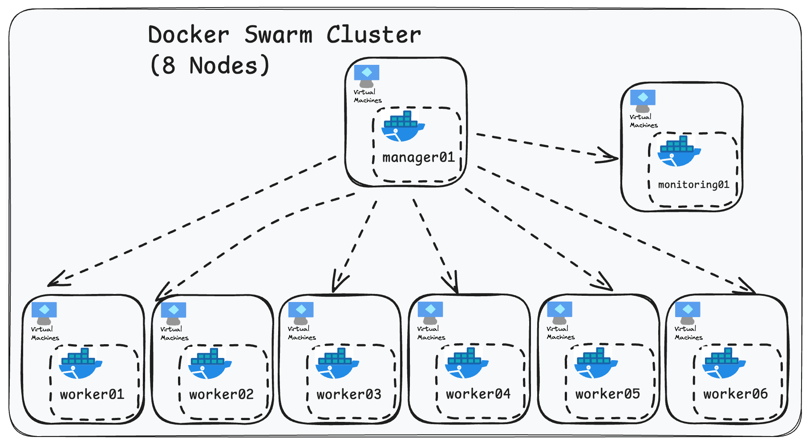
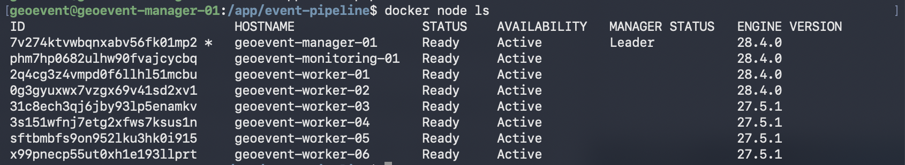
모든 컴포넌트는 Docker로 컨테이너화되어, Azure VM 위에 구축된 총 8-Node Docker Swarm 클러스터에서 동작합니다. 저는 이 클러스터를 1대의 Manager, 6대의 Worker, 그리고 1대의 독립된 Monitoring 노드로 역할을 명확히 분리하여 설계했습니다. 이는 다음과 같은 실제 프로덕션 환경의 아키텍처 원칙을 직접 구현하기 위한 목적이었습니다.
- **워크로드 분산 및 수평적 확장성**: 데이터 처리(Worker)와 클러스터 관리(Manager)의 책임을 분리하여, 향후 데이터 처리량이 증가할 경우 Worker 노드만 수평적으로 확장할 수 있는 유연한 구조를 확보했습니다.
- **장애 격리**: 모니터링 시스템(Prometheus, Grafana)을 위한 노드를 물리적으로 분리함으로써, 관측 시스템의 장애가 전체 프로덕션 워크로드에 영향을 미치거나, 반대로 프로덕션의 부하가 모니터링 시스템을 마비시키는 것을 원천적으로 차단했습니다.

이 모든 파이프라인의 흐름은 Apache Airflow에 의해 DAG(Directed Acyclic Graph)로 정의되어 안정적으로 스케줄링 및 관리됩니다. 

아래 스크린샷은 수백 번의 실행을 통해 파이프라인의 안정적인 운영 상태를 보여줍니다.
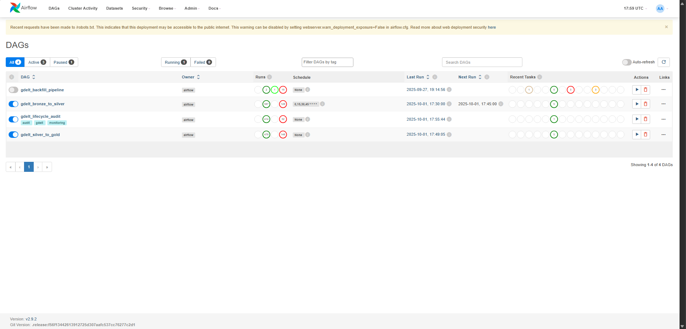

### 4.  기술적 도전과 해결 과정 (Technical Challenges & Solutions)
저는 이 프로젝트를 통해 단순히 기술을 사용하는 것을 넘어, 예측 불가능한 문제를 해결하는 과정에서 엔지니어링 역량을 기를 수 있었습니다. 제가 마주했던 가장 의미있는 4가지 도전과 해결과정은 다음과 같습니다.
#### 4.1 분산 시스템 안에서의 8-Node 클러스터 구축 및 안정화
**문제 정의**: `docker-compose`환경에서는 안정적으로 동작하던 파이프라인이, 8대의 VM으로 구성된 Docker Swarm 클러스터에 배포되자마자 예측 불가능한 연쇄 장애를 일으키며 정상적으로 동작하지 않았습니다. 단순 `Race Condition`을 넘어, 네트워크, 상태 관리, 권한, 런타임 의존성 등 분산 시스템의 모든 계층에서 문제가 동시다발적으로 발생했습니다.

**해결 과정**: 저는 이 복합적인 문제를 해결하기 위해, 특정 에러 메시지에 매몰되지 않고 시스템 전체의 원인을 계층별로 분석하고 해결했습니다.

1.  **네트워크 비결정성 제어**: `UnknownHostException`으로 대표되는 Race Condition 문제를 해결하기 위해, `wait-for-it.sh`와 `sleep`을 도입하여 서비스 시작 순서와 DNS 전파 지연을 명시적으로 제어했습니다.
2. **상태 불일치 해결**: Zookeeper `NodeExistsException`과 같이 비정상 종료된 컨테이너가 남긴 유령 상태가 클러스터 전체를 오염시키는 문제를, `docker system prune --volumes`를 포함한 클러스터 정리로 해결하였습니다.
3. **복잡한 런타임 의존성 충돌 문제 해결**: Spark와 Hive 버전 충돌로 인한 `ClassNotFoundException`(클래스패스 충돌)을 해결하기 위해, 단순히 `Dockerfile`에서 JAR파일을 교체하는 것을 넘어, Spark 클래스패스 로딩 매커니즘을 파악하고, `spark-defaults.conf` 설정을 미세 조정하여 문제를 해결했습니다.
4. **외부 시스템 연결 안정화**: Airflow의 설정 문제로 DB 커넥션이 고갈되어 시스템 전체가 마비되는 커넥션 누수(`Connection Leak`) 문제를, 근본 원인 분석을 통해 `sql_alchemy_pool_recycle` 설정을 최적화 하여 해결했습니다.
5. **최종 해결**: 모든 논리적 문제를 해결했음에도 원인 불명의 권한문제가 특정 노드에서만 발생했을 떄, 저는 UID/GID 불일치가 근본 원인임을 특정하고, 이를 해결하여 클러스터의 안정성을 최종적으로 확보했습니다.
#### 4.2 데이터 기반의 실용주의적 아키텍처 개선

**초기 가설 및 설계**: 프로젝트 초기, EDA를 통해 GDELT의 3개 데이터셋 간에 최대 15시간의 데이터 레이턴시가 존재할 것이라는 가설을 세웠습니다. 이 가설을 바탕으로, 데이터 유실을 최소화하기 위해 과거 15시간의 데이터를 함께 읽어 조인하는 룩백 조인 아키텍처를 설계했습니다.

**데이터 기반 검증 및 문제 발견**: 하지만 파이프라인 안정화 이후, 직접 구축한 데이터 파이프라인 모니터링 시스템을 통해 실제 데이터를 분석한 결과, 99.6%의 데이터가 단일 배치 내에서 즉시 조인된다는 사실을 발견했습니다. 이는 초기 가설이 틀렸으며, 단 0.4%의 예외 케이스를 위해 15시간의 데이터를 스캔하는 것은 심각한 I/O 비효율을 초래하는 오버 엔지니어링임을 데이터로 증명했습니다.

**실용적 개선(배치 처리의 원자성 보장)**: 저는 이 데이터에 근거하여, 복잡한 '룩백 조인' 로직을 과감히 제거했습니다. 그 대신, 3개의 Spark Streaming Job이 서로의 상태를 0.5초마다 확인하여 3개 Job이 모두 성공했을 때만 Kafka 체크포인트(오프셋)를 함께 커밋하고, 하나라도 실패하면 전체 배치를 롤백(미커밋)하여 Airflow 레벨에서 재시도하는 로직을 구현했습니다. 이 경험을 통해, 사후에 데이터를 복구하는 아키텍처보다 장애 발생 자체를 원천적으로 차단하는 설계가 훨씬 더 견고하며, 분산 시스템에서의 데이터 일관성을 어떻게 보증해야 하는지에 이해할 수 있었습니다.
#### 4.3 Custom 모니터링 시스템 구축
저는 파이프라인의 모든 동작을 투명하게 관측하고, 장애의 근본 원인을 진단하기 위해 애플리케이션 레벨과 데이터 레벨의 2단계 Custom 모니터링 시스템을 직접 설계하고 구축했습니다.
#### 4.3.1 애플리케이션 레벨: Spark Custom Exporter 개발
- **문제**: Prometheus의 기본 JMX Exporter 및 내장 Servlet 방식으로는 Spark의 상세 내부 동작(Executor 메모리, GC 등)을 파악하여 성능 병목을 진단하는 데 한계가 있었습니다. 특히 32GB VM에서도 반복적인 Job 실패 문제 발생 시, 원인 규명에 어려움을 겪었습니다.
- **해결**: 이러한 관측 가능성(Observability) 확보를 위해, Spark REST API를 직접 폴링하는 Python 기반 Custom Exporter를 개발했습니다. 기존 방식들의 한계(상세 지표 부족, Swarm 환경 서비스 디스커버리 불안정)를 극복하고, 네트워크 환경에 구애받지 않는 안정적인 메트릭 수집 시스템을 구축했습니다.
- **성과**: 이 Exporter를 통해 Executor, Driver 단위의 핵심 시스템 메트릭을 Grafana 대시보드로 실시간 시각화하여, 성능 병목을 데이터 기반으로 빠르게 진단하고 튜닝할 수 있는 심층적인 관측 가능성을 확보했습니다. 이는 Spark 운영의 안정성과 효율성을 높이는 기반이 되었습니다. 
#### 4.3.2 데이터 레벨: End-to-End Lifecycle Audit 시스템 구축
- **문제**: 시스템 모니터링(`Custom Exporter`)만으로는 파이프라인의 최종 목표인 '데이터 신뢰도'를 정량적으로 증명할 수 없었습니다. 데이터가 파이프라인을 통과하며 유실되거나 과도하게 지연되는 문제를 조기에 감지하고 원인을 추적할 방법이 없었습니다.
- **해결**: 개별 데이터 레코드(`global_event_id` 기준)가 수집부터 최종 적재까지 거치는 모든 단계를 추적하는 'Lifecycle Audit' 시스템을 직접 설계하고 구축했습니다. 각 단계 완료 시 상태(`WAITING`, `SILVER_COMPLETE` 등)와 타임스탬프를 Delta Lake 테이블에 기록하고, 이를 Pushgateway를 통해 Prometheus로 집계하여 Grafana 대시보드로 시각화했습니다.
####  4.4 배포 자동화 스크립트 개발(`remote-deploy.sh`)
**문제 정의**: 8개 노드로 구성된 분산 환경에서 수동으로 배포하는 것은 비효율적이고 위험했습니다. 각 노드의 설정이 조금씩 달라지는 문제는 예측 불가능한 장애의 원인이 될 수 있었고, 반복적인 수동 작업은 실수할 가능성을 높였습니다. 언제 실행해도 동일한 결과가 나오는 안정적인 배포 방식이 필요했습니다.

**해결 과정**: 저는 이 문제를 해결하기 위해, 모든 배포는 Git의 코드를 유일한 기준으로 삼도록 하는 배포 자동화 스크립트(`remote-deploy.sh`)를 직접 개발했습니다. 로컬에서 명령어 하나로 8개 노드 전체에 `git pull`을 실행하고, 변경된 서비스만 안전하게 재시작하도록 구현했습니다. 이 과정에서 `ssh-agent`를 이용한 인증 관리, 원격 `sudo` 권한 문제 등 분산 환경에서 배포할 때 겪는 현실적인 문제들을 해결했습니다.

**성과**: 이 스크립트를 통해 배포 시간을 90% 단축하고, 수동 작업으로 인한 실수 가능성을 최소화했습니다. 이 경험을 통해 배포 과정을 코드로 관리하는 방식의 중요성과 효과를 이해할 수 있었습니다. 향후 이 스크립트를 GitHub Actions로 이전하여, 특정 브랜치에 코드가 푸시될 때 자동으로 테스트와 배포가 이루어지는 완전한 CI/CD 파이프라인으로 고도화할 계획입니다.
### 5. 시스템 운영 및 결과 (System Operation & Results)
이 프로젝트는 단순히 구축에서 끝나지 않고, 안정적인 운영을 목표로 설계되었습니다. 본 파이프라인은 8-node Docker Swarm 클러스터 환경에서 25개의 컨테이너 서비스로 운영되었습니다.
#### 5.1 파이프라인 안정화(Before & After)
`섹션 4`에서 언급했듯이, 프로젝트 안정화 초기에는 `4.1`의 클러스터 문제(커넥션 누수, 의존성 충돌 등)와 `4.2`의 비효율적인 조인 로직 등 복합적인 문제들이 동시에 발생했습니다.

아래는 이 문제 해결 전(Before), 파이프라인 Health가 UNHEALTHY 상태에 머무르며 조인 성공률이 8%대에 불과했던 실제 대시보드 화면입니다.
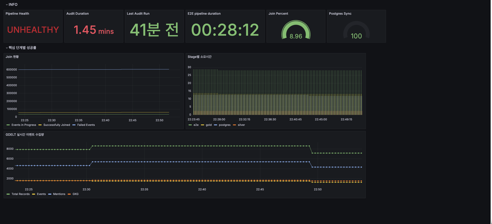

`섹션 4`의 문제들을 모두 해결하고 아키텍처를 개선한 이후(After), 조인 성공률 100%를 달성하며 파이프라인이 HEALTHY 상태를 회복한 것을 볼 수 있습니다.
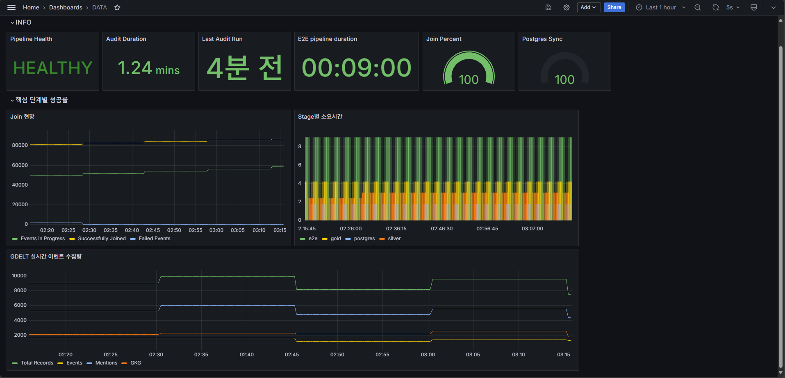

#### 5.2 시스템 관측 가능성 (Observability) 확보
`4.3`에서 설명한 Custom Spark Exporter를 개발하여, 기존 JMX Exporter나 Prometheus Servlet 방식의 한계를 극복하고 Spark의 상세 내부 지표(Driver/Executor의 CPU, Memory, GC 등)를 실시간으로 수집했습니다.

아래는 이 Exporter를 통해 구축한 Spark 리소스 모니터링 대시보드의 실제 운영 화면으로, 이를 통해 성능 병목을 데이터 기반으로 진단하고 튜닝할 수 있는 심층적인 관측 가능성을 확보했습니다.
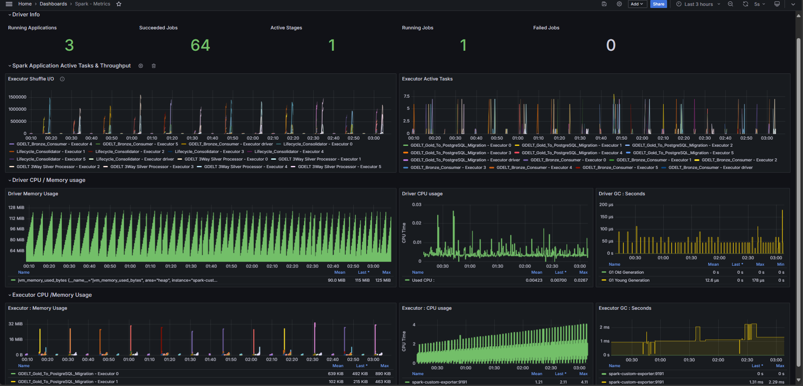
### 6. 기술 스택 (Tech Stack)
- **Data Pipeline**: `Kafka`, `Spark`, `Airflow`, `dbt`, `Hive Metastore`, `Delta Lake`
- **Infrastructure**: `Docker`, `Docker Swarm`, `MinIO`, `PostgreSQL`
- **Monitoring**: `Prometheus`, `Pushgateway`, `Grafana`, `Custom Spark Exporter`
- **Cloud**: `Azure VM`
- **Language & Tools**: `Python`, `SQL`, `Git`
### 7. 향후 개선 과제 (Future Improvements)
이 프로젝트는 안정적인 운영의 기반을 마련했으며, 향후 다음과 같은 우선순위에 따라 프로덕션급 시스템으로 고도화할 계획입니다.
1. **데이터 기반 Spark 리소스 튜닝:** 현재 보수적으로 할당된 Spark 리소스를, `5.2`에서 직접 구축한 모니터링 데이터에 근거하여 정교하게 튜닝할 계획입니다. Executor 메모리, GC 시간 등 실제 워크로드 지표를 분석하여 최소한의 리소스로 최대의 성능을 내도록 최적화하고, 클러스터 운영 비용을 절감하는 것을 목표로 합니다.
2. **CI/CD 파이프라인 자동화:** `4.4`에서 수동으로 실행하도록 개발한 배포 스크립트(`remote-deploy.sh`)를 GitHub Actions 기반으로 자동화합니다. Git Push 시 자동으로 빌드, 테스트, 배포가 이루어지는 CI/CD 파이프라인을 구축하여, 휴먼 에러를 방지하고 개발 생산성을 높일 것입니다.
3. **비즈니스 지표 기반의 지능형 Alert 시스템 구축:** 현재의 모니터링 시스템을 확장하여 Alertmanager를 도입하고, 장애 발생 시 Slack으로 즉시 알림을 받도록 구축할 것입니다. 특히 CPU, 메모리 같은 단순 시스템 지표를 넘어, `5.1`의 '데이터 조인 성공률'이나 '데이터 처리 지연 시간' 같은 핵심 비즈니스 지표를 기반으로 임계치를 설정하여, 실제 서비스 영향이 발생하기 전에 대응할 수 있는 시스템을 만들겠습니다.

